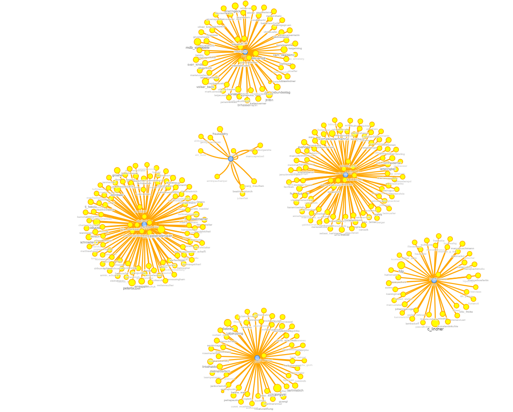
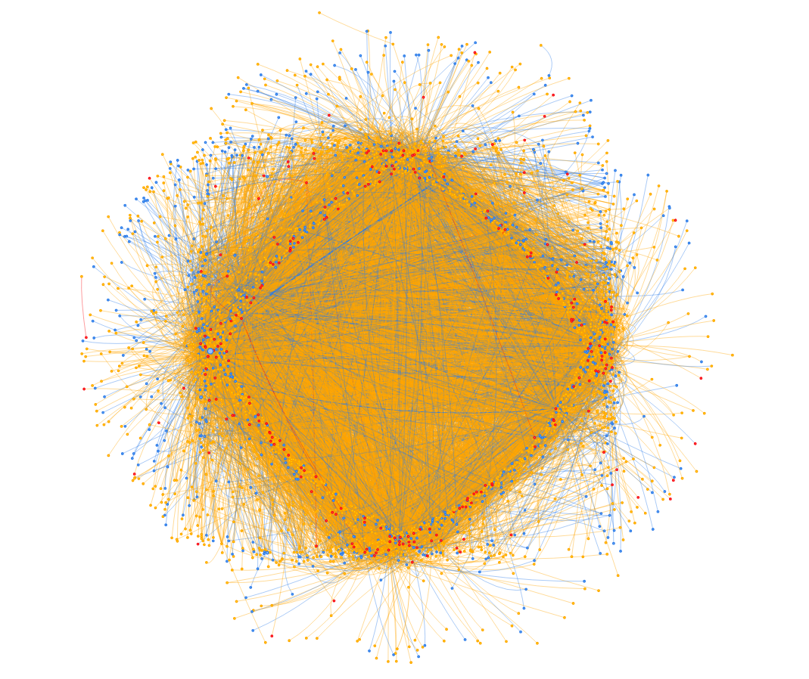
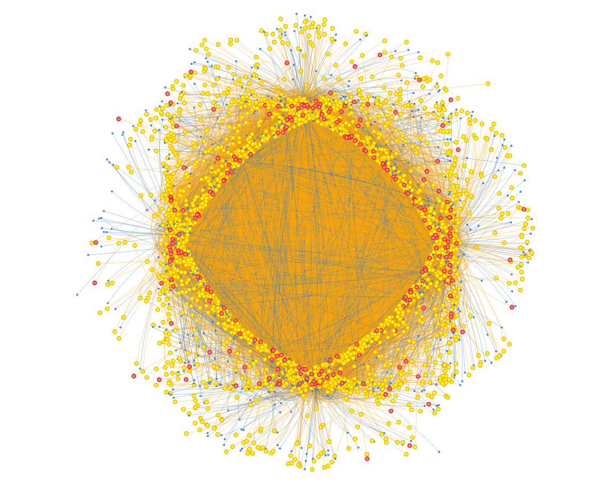

# Social-Network-Analysis
### Twitter German 2017 election campaign analysis
## Overview
This work tries to investigate the part that social media plays in driving election campaigns and results

Dataset source: https://zenodo.org/record/835735#.XAKJw2gzbQA

## Project Workflow

### 1. Dataset collection
- Get party-member followers from Twitter

### 2. Preprocessing
- Minify JSON files to reduce size. Initial dataset size amounted to 10GB
- Detect invalid JSON files and discard them
- Concatenate 1308 JSON files to 13 files

### 3. Importing
- Import party-member
  - Relate every member with a party using a _MEMBER_OF_ relationship
- Import party-member followers
  - Relate follower with party-member using a _FOLLOWS_ relationship
- Import tweets
  - Create user _POSTS_ tweet relationship
  - Create tweet _RETWEETS_ tweet relationship
- Set members, followers as users
- Set database constraints
### 4. Graph algorithms and related analysis
- Page rank
  - Users who were followed the most
  - Users who were retweeted the most
  - Distinct characteristics of the above users
- Harmonic centrality
  - Users who are connected to a wide variety of people based on retweets
  - Check if those users happen to be party members
- Betweenness centrality
  - Users who can better link different groups
- Other analysis
  - Idea of the no.of tweeters related to each party
  - Time analysis of tweets leading into the election
  - Time analysis of no.of new accounts leading into the election
### 5. Visualisation

  
a) Party-member graph

  
b) Betweenness centrality

  
c) Harmonic centrality

  

 

  
  

## Conclusion

Results showed how the twitter activity increased leading into the election. Although social media can give insights to some extent, the current limited analysis shows that election results can't be confidently predicted with the current analysis done. The analysis did give a rough idea of the top parties, but a single party wasn't at the top most of the times to confidently predict. 

Nonetheless, for future analysis, text processing could be used to give much more better and reliable results as that could capture the sentiment and mood in the tweets.
